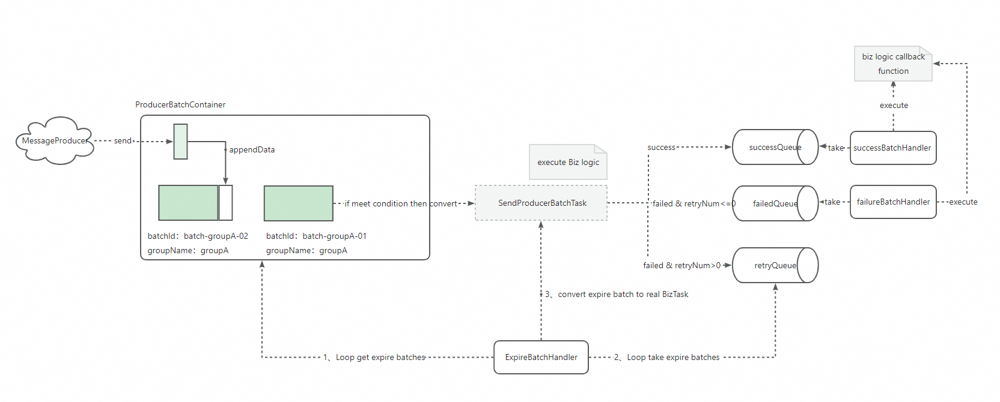

# WaitingBusBatch （WBB） 内存攒批工具

#### 介绍
**内存“攒批工具”** waiting-bus-batch 是一个能够支持在内存中进行多分批延迟处理的工具。
适用于需要将上游（例如消费MQ消息）投递的消息进行攒批，达到设定规则之后再去调用下游业务或者再开启消息处理的场景。
该攒批工具具有如下优点：
- 使用简单，配置项少，线程安全
- 支持分组攒批
- 支持设定内存上限，可有效避免JVM内存占用问题
- 支持设定时间红线、数量红线、内存占用红线种规则，达到红线后会自动启动消息处理逻辑
- 支持重试
- 回调能力丰富，成功、失败都有对应的回调接口可供实现
- 提供可观测的API，可以了解当前攒批任务的各项指标
- 支持优雅关闭，系统关闭时会将内存中还未被发送的数据全部触发消费逻辑

#### 快速入门
（1）创建一个生产者配置类，最简单的生产者配置示例如下：
```java
ProducerConfig producerConfig = new ProducerConfig();
// 设定攒批达到20条以上的时候再执行业务逻辑
producerConfig.setBatchCountThreshold(20);
// 设定攒批已经达到100s的时候再执行业务逻辑
producerConfig.setLingerMs(100_000);
// 可以指定攒批重试次数
producerConfig.setRetries(2);
```

此外还可以再去设置攒批最大占据内存大小，攒批容器最大占据内存大小，等参数。详情可以参考 ProducerConfig 类进行设定。

（2）创建 MessageProducer 对象，同时指定攒批条件达成时，需要执行的业务逻辑，示例如下：
```java
private static MessageProducer getMessageProducer(ProducerConfig producerConfig) {
    return new MessageProducer(producerConfig, (List<Message> arr) -> {
        // do your business here
        return MessageProcessResultEnum.SUCCESS;
    });
}
```
在消费代码中，如果主动返回  MessageProcessResultEnum.SUCCESS; WBB会认为当前攒批已经被下游成功消费，返回 SUCCESS 则认为消费成功，返回RETRY 则会进入重试队列，等待重试。需要关注的是如果你的业务代码处理时出现了异常也会加入重试队列。

（3）接收上游的消息开启内存攒批，这里以RocketMQ消息消费为例：
```java
public static void main(String[] args) {

      DefaultMQPushConsumer consumer = new DefaultMQPushConsumer("consumer_group_test");

      ProducerConfig producerConfig = new ProducerConfig();
      // 设定攒批达到20条以上的时候再执行业务逻辑
      producerConfig.setBatchCountThreshold(20);
      // 设定攒批已经达到100s的时候再执行业务逻辑
      producerConfig.setLingerMs(100_000);
      // 可以指定重试次数
      producerConfig.setRetries(2); 
      MessageProducer messageProducer = getMessageProducer(producerConfig);

      try {
          consumer.setNamesrvAddr("localhost:9876");
          consumer.subscribe("test_topic", "*");
          consumer.registerMessageListener(new MessageListenerConcurrently() {
              @Override
              public ConsumeConcurrentlyStatus consumeMessage(List<MessageExt> messages, ConsumeConcurrentlyContext context) {
                  List<Message> messageList = new ArrayList<>();
                  for (MessageExt message : messages) {
                      Message msg = convert(message);
                      messageList.add(msg);
                  }
                  // 调用攒批发送器  去发送消息，开启内存攒批
                  messageProducer.send(null, messageList);
                  return ConsumeConcurrentlyStatus.CONSUME_SUCCESS;
              }
          });
          consumer.start();
      } catch (Exception e) {
          e.printStackTrace();
      }
}
```
调用messageProducer的send方法以后，就会将收到的消息加入到攒批过程中，在上面的例子中当攒批队列长度达到20个元素以上或者攒批时间已经超过100s时（或者攒批队列的占据最大内存超过设定值，默认8M）就会触发攒批消费，也就是会执行创建MessageProducer 时指定的业务逻辑。

此外可以支持设置“追加攒批回调”，也就是为每一次往攒批队列中追加操作设置回调函数，如下面的示例代码所示，当消息被追加到攒批队列中并被成功消费后，会执行回调函数。
```java
ListenableFuture<Result> listenableFuture = messageProducer.send(null, messageList, (result) -> {
    if (result.isSuccessful()) {
        System.out.println("执行成功 SequenceNo=" + appendSequenceNo);
    } else {
        System.out.println("执行失败 SequenceNo=" + appendSequenceNo);
    }
});
// 也可以直接为 listenableFuture 绑定监听 了解每次追加的消息的消费结果
```

#### 软件架构


#### 安装教程
1、引用依赖
``` xml
<dependency>
    <groupId>io.github.ahucodingbeast</groupId>
    <artifactId>waiting-bus-batch</artifactId>
    <version>1.0.0</version>
</dependency>
```


2、参考源码中的实例代码，使用攒批功能

#### 使用说明
1. 阅读QuickStartDemo.java 了解使用入门
2. 阅读掘金专栏文章：https://juejin.cn/post/7338605981594894399 了解更多
 

